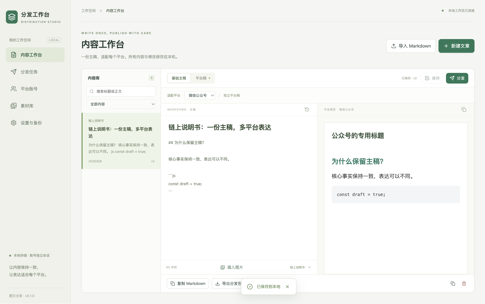

# 分发工作台

独立的 Windows / macOS 图文分发客户端。以一份 Markdown 主稿为基础，维护平台独立稿，通过各账号的独立浏览器会话填充发布编辑器。内容、图片和任务保存在本机。

## 开始使用

开发环境要求 Node.js 22.12+（推荐 `nvm use`）。

```sh
npm ci
npm run dev
```

生产构建与运行：

```sh
npm run build
npm start
```

打包：

```sh
npm run dist:mac
npm run dist:win
```

产物在 `release/`。安装包暂未签名，macOS 包未公证，安装时可能出现系统安全提示。验证记录见 [自动化验证](docs/ACCEPTANCE.md)。

## 使用流程

1. 新建或导入 Markdown。导入支持首行 H1、简单 frontmatter 标题，以及文章目录及子目录中的相对图片路径。不会遍历上级目录读取文件。
2. 在主稿中整理事实和步骤，切换平台预览排版。平台稿可以独立改写；公众号自动应用内联样式，小红书需要独立短稿与配图。
3. 在平台账号页添加账号并打开官方平台窗口登录。同平台的多个账号分别使用独立会话。
4. 保存文章，点击分发，选择账号和可选预约时间。创建任务时固定内容快照；同账号相同内容不能重复创建。
5. 在平台窗口打开空白文章编辑器。客户端识别标题与正文后执行填充。平台已有其他内容时停止，不自动覆盖。
6. 检查图片、封面、标签、分类与预览，在平台完成最终发布。回工作台填写文章链接，登记“已人工确认发布”。

公众号通常需要先在后台手动新建图文；简书需要选择文集并新建文章。验证码、认证和平台审核由平台本身完成。

## 已实现

- 主稿库、分类与全文搜索，最近 30 次主稿历史、恢复与复制。
- 九个第三方平台的编辑器适配入口；自建 Web 的 HTML / Markdown 导出。
- 主稿与平台稿独立编辑、隔离预览、富文本/Markdown 复制。
- 图片按 SHA-256 去重、引用、导入、可移植分发 ZIP。
- 多账号独立持久化会话，官方页面登录和编辑器可用性检查。
- 持久化队列、预约、暂停、失败继续、重复拦截、日志和人工登记发布链接。
- 原子数据文件替换、上一次状态备份、中断恢复、完整内容备份与恢复。
- 渲染器和平台页面隔离，窄 IPC、输入校验、HTML 清洗和导航域名限制。

## 当前边界

- 自动化覆盖“填入编辑器并回读检查”；不伪装成正式发布成功。页面保存、图片转存与最终发布由用户检查。
- 小红书短稿由用户编辑，不调用 AI、不自动截断正文。其他平台按主稿或独立平台稿分发。
- 预约执行要求客户端运行。正常退出后到期的队列下次启动会执行；运行中意外中断的任务转为需要处理。
- 图片在预览中显示不等于平台已转存。远程图片可能被防盗链或跨域策略阻止，必要时使用本地图片并在平台上传。
- 当前没有云端账号托管、后台关机发布、团队权限、统计采集。

## 工程结构

```text
src/domain.ts          领域模型、平台元信息与跨进程契约
src/main.tsx           工作台界面
src/styles.css         界面样式
electron/store.ts      持久化、版本、快照、任务去重
electron/content.ts    Markdown 渲染、清洗、平台排版
electron/publisher.ts  独立会话与发布任务执行
electron/inject.ts     页面编辑器检测、冲突预检、填充回读
electron/main.ts       桌面生命周期、IPC、文件导入导出
electron/preload.ts    最小工作台桥接
```

生图请求与配置管理位于 `electron/image-api.ts` 和 `electron/image-config.ts`。第三方依赖许可见 [THIRD_PARTY_NOTICES.md](THIRD_PARTY_NOTICES.md)。

## 验证

```sh
npm run typecheck
npm test
npm run test:e2e
```

E2E 使用真实 Electron 进程和独立临时工作区，用本地 HTML 夹具替代平台网络响应；不登录、不发送真实文章。测试覆盖 UI、主进程文件操作、跨进程调用与编辑器填充。截图和报告保存在 `test-results/`、`playwright-report/`。

## 下载 v0.2.3（预发布）

- [macOS Apple Silicon ZIP](https://github.com/gallonyin/distribution-studio/releases/download/v0.2.3/DistributionStudio-0.2.3-mac-arm64.zip)
- [Windows x64 安装器](https://github.com/gallonyin/distribution-studio/releases/download/v0.2.3/DistributionStudio-0.2.3-win-x64.exe)
- [SHA-256 校验和](https://github.com/gallonyin/distribution-studio/releases/download/v0.2.3/SHA256SUMS.txt)



## AI 配图

已接入火山方舟、阿里云百炼、MiniMax 的文字生图。设置中配置服务，素材库中生成并插入文章；支持配置导入导出，密钥加密保存在仓库外。详见 [生图配置](docs/IMAGE-GENERATION.md)。

素材卡片支持点击放大、原始尺寸查看与删除。删除前检查主稿、平台稿、历史版本和任务快照引用；未引用的原图移至用户数据目录的 `deleted-assets/`，可通过导入图片恢复。

## 配置与贡献

用户配置、密钥、工作区数据和安装包不纳入 Git。可分享的无密钥模板为 [image-providers.example.json](image-providers.example.json)；通过设置页导出配置可迁移服务地址、模型和偏好，也可选择包含密钥。

欢迎提交 Issue 和 PR，开发流程见 [CONTRIBUTING.md](CONTRIBUTING.md)。本项目采用 [MIT](LICENSE) 许可。

## 参考

[MultiPost](https://github.com/leaperone/MultiPost-Extension) · [Wechatsync](https://github.com/wechatsync/Wechatsync)
